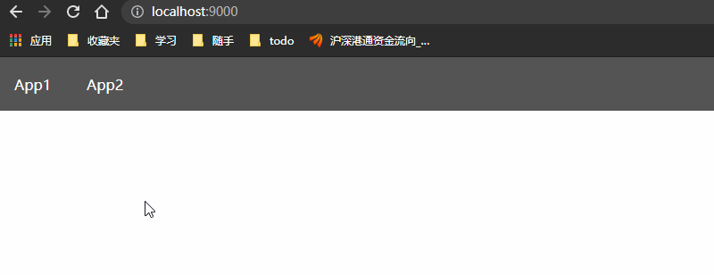

# single-spa 简单实现

## 前提

```
npm install
```

## 快速开始

```
npm run dev
```

然后在浏览器中访问：http://localhost:9000

效果展示：



## 项目构建

```
npm run build
```

## 具体实现教程

[实现教程](https://github.com/jackenl/my-single-spa/blob/master/docs/%E4%BB%8E%E9%9B%B6%E5%BC%80%E5%A7%8B%E5%AE%9E%E7%8E%B0%E4%B8%80%E4%B8%AA%E5%AE%8C%E6%95%B4%E7%9A%84%20Single-spa.md)