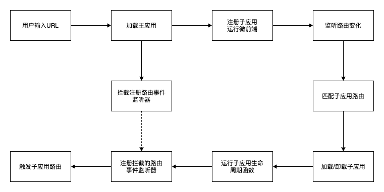
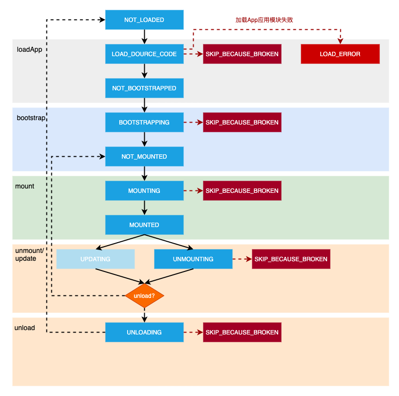

# 从零开始实现一个完整的 Single-spa

微前端概念做为现在前端比较热门的技术领域，受到了广大前端技术人员的热捧，而 Single-spa 则是现在比较成熟的微前端技术解决方案。Single-spa 是一个将多个单页面应用聚合为一个整体应用的 JavaScript 微前端框架。

## 微前端核心流程

Single-spa 的核心执行流程大致如下：



首先加载主应用，使用微前端框架注册子应用启动运行微前端，同时重写事件监听器添加、移除函数拦截注册事件监听器，添加路由事件监听监听路由变化，匹配对应子应用路由进行加载、卸载子应用。当子应用加载完成后执行子应用生命周期函数，同时注册拦截的路由事件监听器触发子应用路由，至此一个完整的微前端核心流程就完成了。

接下来，我们开始手把手从零开始实现一个 Single-spa 框架。

## 应用注册


Single-spa 框架的使用方法如下：

```js
// 申明子应用
const app = {
  bootstrap: () => Promise.resolve(), //bootstrap function
  mount: () => Promise.resolve(), //mount function
  unmount: () => Promise.resolve(), //unmount function
};

// 注册子应用
singleSpa.registerApplication('appName', app, '/subApp');

// 运行微前端                        
singleSpa.start();
```

sing-spa 的应用主要分为三个步骤：

1. 申明子应用，暴露子应用生命周期，包括：`bootstrap`、`mount`、`unmount`、`update`。
2. 调用`singleSpa.registerApplication`函数进行子应用注册。
3. 最后执行`singleSpa.start`函数开始运行微前端。

子应用注册流程相对来说比较简单，只需用一个数组来维护存储进行注册的子应用就行，应用注册实现逻辑如下：

```js
// 用于存储注册的app
const apps = [];

export function registerApplication(name, loadApp, activeWhen, customProps) {
  const registration = {
    name,
    loadApp: sanitizeLoadApp(loadApp),
    activeWhen: sanitizeActiveWhen(activeWhen),
    customProps: sanitizeCustomProps(customProps),
  };

  apps.push(
    Object.assign(
      {
        status: NOT_LOADED, // 默认状态
      },
      registration
    )
  );
}

function sanitizeLoadApp(loadApp) {
  // 保证loadApp执行返回的是promise
  if (typeof loadApp !== 'function') {
    return () => Promise.resolve(loadApp);
  }

  return loadApp;
}

function sanitizeActiveWhen(activeWhen) {
  let activeWhenArray = Array.isArray(activeWhen) ? activeWhen : [activeWhen];
  return (location) => activeWhenArray.some((activeWhen) => activeWhen(location));
}

function sanitizeCustomProps(customProps) {
  return customProps ? customProps : {};
}
```

所有子应用注册完成后，需调用`singleSpa.start`函数启动微前端框架，进行应用初始化，加载路由匹配到的子应用。

```js
import { reroute } from "./navigation/reroute";

let started = false;

export function start() {
  started = true;
  reroute(); // 进行应用更改，加载匹配到的子应用
}
```

其中应用更改函数`reroute`就是 Single-spa 框架的核心实现，后面会对其进行展开说明。

## 路由拦截

给主应用设置路由监听，确保路由切换时监听路由变化重写匹配加载对应的子应用。

同时，在触发挂载的子应用的路由监听前，需进行确认微前端是否已启动，如果尚未启动则匹配的子应用尚未进行挂载，需先进行加载对应的子应用再触发子应用的路由监听切换。实现方法也很简单，就是重写 history API 函数`pushState`和`replaceState`，拦截 history 更改。

```js
function urlReroute() {
  reroute([], arguments);
}

function patchedUpdateState(updateState, methodName) {
  return function () {
    const urlBefore = window.location.href;
    const result = updateState.apply(this, arguments);
    const urlAfter = window.location.href;

    if (urlBefore !== urlAfter) {
      if (isStarted()) {
        // 如果已启动，则正常分发 history 事件
        window.dispatchEvent(createPopStateEvent(window.history.state, methodName));
      } else {
        // 否则初始化应用生命周期
        reroute([]);
      }
    }

    return result;
  };
}

function createPopStateEvent(state, methodName) {
  let evt = new PopStateEvent('popstate', { state });

  evt.singleSpa = true;
  evt.singleSpaTrigger = methodName;
  return evt;
}

// 监听路由事件触发修改应用生命周期
window.addEventListener('hashchange', urlReroute);
window.addEventListener('popstate', urlReroute);

// 重写 history API，判断微前端是否已启动，匹配对应对应操作
window.history.pushState = patchedUpdateState(window.history.pushState, 'pushState');
window.history.replaceState = patchedUpdateState(window.history.replaceState, 'replaceState');
```

在子应用加载完成后但尚未挂载到主应用时，子应用的挂载节点还没有被创建，路由发生更改会触发子应用的路由事件访问并不存在的节点，导致代码执行错误，所以需对路由事件监听器的注册进行拦截，确保自应用挂载完成后再注册拦截的路由事件监听器。

```js
// 用于收集路由事件监听器
const eventListeners = {
  hashchange: [],
  popstate: [],
};

export const eventNames = ['hashchange', 'popstate'];

// 重写事件监听器添加和移除函数，拦截和收集路由事件监听器
const originAddEventListener = window.addEventListener;
const originRemoveEventListener = window.removeEventListener;
window.addEventListener = function (eventName, fn) {
  if (
    eventNames.indexOf(eventName) >= 0 &&
    !find(eventListeners[eventName], (listener) => listener === fn)
  ) {
    eventListeners[eventName].push(fn);
    return;
  }

  return originAddEventListener.apply(this, arguments);
};
window.removeEventListener = function (eventName, fn) {
  if (eventNames.indexOf(eventName) >= 0) {
    eventListeners[eventName] = eventListeners[eventName].filter((listener) => listener !== fn);
    return;
  }

  return originRemoveEventListener.apply(this, arguments);
};
```

于是在子应用完成挂载后，执行注册所有收集的路由事件拦截器。

```js
export function callAllEventListener(eventArgs) {
  if (!eventArgs) return;

  const eventType = eventArgs[0].type;
  if (eventNames.indexOf(eventType) >= 0) {
    eventListeners[eventType].forEach((listener) => {
      try {
        listener.apply(this, eventArgs);
      } catch (err) {
        throw err;
      }
    });
  }
}
```

## 应用更改

进行应用更改前，首先根据应用状态筛选需要卸载和挂载的应用。

```js
export function getAppChanges() {
  const appsToUnload = [],
    appsToUnmount = [],
    appsToLoad = [],
    appsToMount = [];

  apps.forEach((app) => {
    const appShouldBeActive = apps.status !== SKIP_BECAUSE_BROKEN && shouldBeActive(app);

    switch (app.status) {
      case LOAD_ERROR:
        if (appShouldBeActive) {
          appsToLoad.push(app);
        }
        break;
      case NOT_LOADED:
      case LOADING_SOURCE_CODE:
        if (appShouldBeActive) {
          appsToLoad.push(app);
        }
        break;
      case NOT_BOOTSTRAPPED:
      case NOT_MOUNTED:
        if (!appShouldBeActive && getAppUnloadInfo(app.name)) {
          appsToUnload.push(app);
        } else if (appShouldBeActive) {
          appsToMount.push(app);
        }
        break;
      case MOUNTED:
        if (!appShouldBeActive) {
          appsToUnmount.push(app);
        }
        break;
    }
  });

  return { appsToUnload, appsToUnmount, appsToLoad, appsToMount };
}
```

获取需要进行卸载和挂载的应用后，进行挂载和卸载的对应的子应用队列，确保所有应用更改队列执行完成后，再进行路由事件监听注册。另外，要考虑一些网络等原因导致的上一次应用更改还没有执行完成，将本次应用更爱队列缓存起来，等待上一次的更改完成后再执行。

```js
// 生命周期执行转换，执行完成后返回 promise
import { getAppChanges, getMountedApps } from '../applications/apps';
import { shouldBeActive } from '../applications/helper';
import { toBootstrapPromise } from '../lifecycles/bootstrap';
import { toLoadPromise } from '../lifecycles/load';
import { toMountPromise } from '../lifecycles/mount';
import { toUnloadPromise } from '../lifecycles/unload';
import { toUnmountPromise } from '../lifecycles/unmount';

import { isStarted } from '../start';
import { callCapturedEventListeners } from './navigation';

let appChangeUnderway = false; // 判断应用是否更改中
let waitingOnAppChange = []; // 用于存储等待中的上次应用更改

export function reroute(pendingPromises = [], eventArgs) {
  // 应用更改中，缓存本次应用更改用于更改完成后执行
  if (appChangeUnderway) {
    return new Promise((resolve, reject) => {
      waitingOnAppChange.push({
        resolve,
        reject,
        eventArgs,
      });
    });
  }

  const {
    appsToUnload,
    appsToUnmount,
    appsToLoad,
    appsToMount,
  } = getAppChanges();

  if (isStarted()) {
    // 微前端启动中，进行应用更改
    appChangeUnderway = true;
    return preformAppChanges();
  } else {
    // 加载相关应用
    return loadApps();
  }

  function loadApps() {
    return Promise.resolve().then(() => {
      const loadPromises = appsToLoad.map(toLoadPromise);

      return Promise.all(loadPromises)
        .then(callAllEventListeners)
        .catch((err) => {
          callAllEventListeners();
          throw err;
        });
    });
  }

  function preformAppChanges() {
    return Promise.resolve().then(() => {
      // 移除和卸载需要卸载的应用
      const unloadPromises = appsToUnload.map(toUnloadPromise);
      const unmountPromises = appsToUnmount
        .map(toUnmountPromise)
        .map((promise) => promise.then(toUnloadPromise));
      const unmountAllPromises = Promise.all(unmountPromises.concat(unloadPromises));
  
      // 加载和挂载需要进行挂载的应用
      const loadPromises = appsToLoad.map((app) => {
        return toLoadPromise(app).then((app) => {
          bootstrapAndMount(app);
        });
      });
      const mountPromises = appsToMount.map((app) => bootstrapAndMount(app));

      // 确保应用卸载和挂载完成后在注册路由事件监听器
      return unmountAllPromises
        .then(() => {
          callAllEventListeners();
          // 完成应用挂载，继续执行等待中的应用更改队列
          Promise.all(mountPromises.concat(loadPromises)).then(finishUpAndReturn);
        })
        .catch((err) => {
          callAllEventListeners();
          throw err;
        });
    });
  }

  function finishUpAndReturn() {
    // 完成应用更改，返回挂载的应用名称
    const returnValue = getMountedApps();
    pendingPromises.forEach((promise) => promise.resolve(returnValue));

    appChangeUnderway = false;

    if (waitingOnAppChange.length > 0) {
      const nextPromises = waitingOnAppChange;
      waitingOnAppChange = [];
      // 执行上次等待中的应用更改
      reroute(nextPromises);
    }

    return returnValue;
  }

  function callAllEventListeners() {
    pendingPromises.forEach((promise) => {
      callCapturedEventListeners(promise.eventArgs);
    });

    callCapturedEventListeners(eventArgs);
  }
}

function bootstrapAndMount(app) {
  if (shouldBeActive(app)) {
    return toBootstrapPromise(app).then((app) => {
      return shouldBeActive(app) ? toMountPromise(app) : app;
    });
  }
  return app;
}
```

## 生命周期

为了更好的管理所有子应用，保证匹配加载和卸载到正确的子应用，Single-spa 框架实现了一套完善的应用生命周期流程。其中每个子应用存在12个生命周期状态，每个状态的转换流程如下：


参考自https://github.com/YataoZhang/my-single-spa/issues/4

从 loadApp 函数执行加载对应子应用后，根据子应用的路由匹配函数`activeWhen`返回的匹配结果执行子应用对应的生命周期函数，挂载匹配到子应用，卸载未匹配到的子应用，设置路由事件监听，监听路由变化不断循环执行该生命周期流程。

Single-spa 的整个生命周期执行流程其实也就是应用更改函数`reoute`的核心执行流程，如果你对前面的应用更改函数的逻辑还有疑问的话，建议翻到前面结合该图进行梳理，相信你就能够很好的理解 Single-spa 的核心实现了。

## 具体实践

从前面的 Single-spa 的应用注册、运行，到设置路由拦截，再到应用的切换和用于应用切换的生命周期管理，我们已经完整的分析了 Single-spa 微前端框架的实现逻辑，接下来就是具体的实践了。

具体代码实现见仓库地址：https://github.com/jackenl/my-single-spa

至此，从零开始实现一个完整的 Single-spa 微前端框架教程就大功告成啦！

如有疑问，欢迎评论交流。